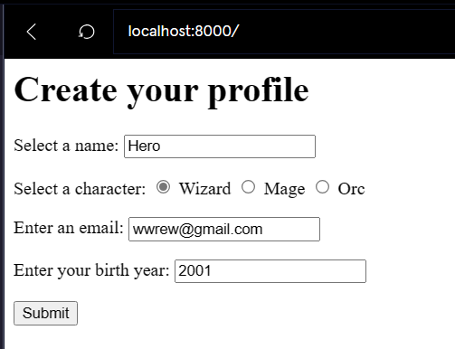
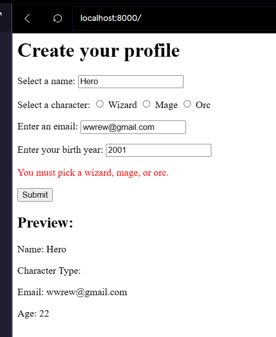
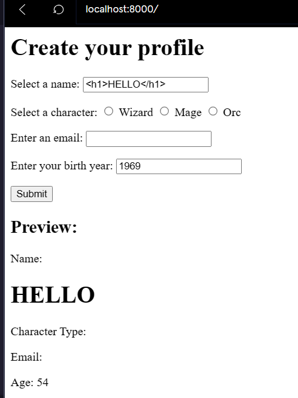
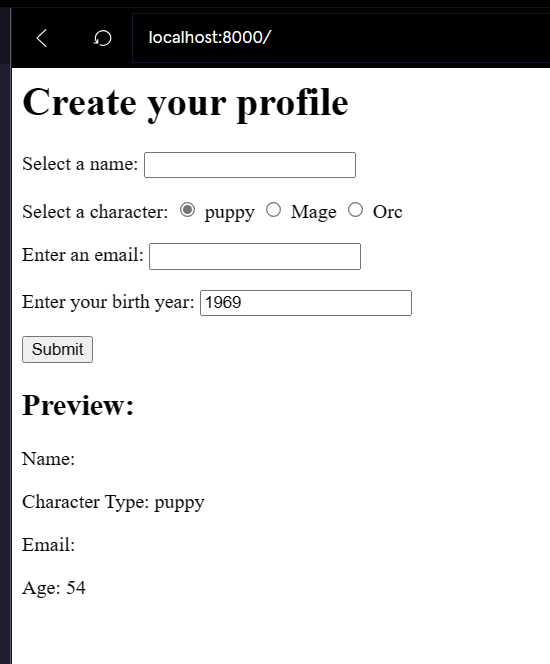
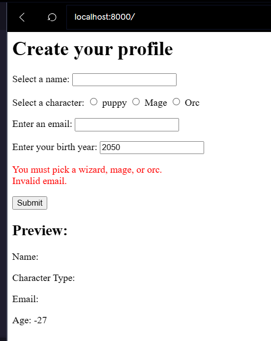
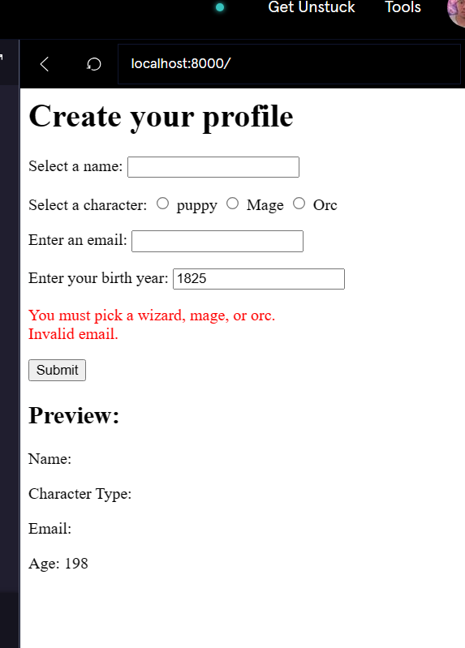

[](https://www.codecademy.com/paths/php-skill/tracks/php-and-html/modules/learn-php-php-form-validation-sp/projects/bobby-tables)
<br><br>


# Bobby Tables

# 1. Introduction:
Collecting input from users is necessary, but nefarious users can use this as an opportunity to mess with things.

Just like the parents of [Bobby Tables](https://xkcd.com/327/).

We’ve made a form for a user to create a profile on our site. We want to collect the user’s name, character, email and birth year. Our users have been having a field day with this and we need to clean up our form.

Let’s begin!

# 2. Output:




# 3. Prompts:


> 1. Try submitting some HTML in the name input box, like <b>\<h1>HELLO\</h1></b>.<br><br>
Can you see how this could cause problems if another user was browsing this profile?



<br>

> 2. We want to allow users to use HTML characters in their names, but we don’t want to interpret them.<br><br>
Where we are assigning <b>$name</b> to the input value, use a built-in function to transform any HTML characters in the input into HTML entities.
```php
$name = htmlspecialchars($_POST["name"]);
```
<br>

> 3. Let’s also remove any leading or trailing whitespace from the name.<br><br>
Use a built-in function for this.
```php
$name = trim(htmlspecialchars($_POST["name"]));
```

<br>

> 4. We also want to prevent people impersonating other users. To do this, we need to check the name from the input against the contents of the array <b>$existing_users</b>.<br><br>
Instead of assigning to the variable <b>$name</b> directly, assign the transformed value of the input to <b>$raw_name</b>.
```php
$raw_name = trim(htmlspecialchars($_POST["name"]));
```

<br>

> 5. Check if <b>$raw_name</b> is in <b>$existing_users</b>, using the [built-in function](https://www.php.net/manual/en/function.in-array.php) <b>in_array</b>.<br><br>
If it is, concatenate <b>"This name is taken. \<br>";</b> to <b>$validation_error</b>.<br><br>
If it is a new name, assign <b>$raw_name</b> to <b>$name</b>.
```php
$raw_name = trim(htmlspecialchars($_POST["name"]));
if (in_array($raw_name, $existing_users)) {
  $validation_error .= "This name is taken. <br>";
} else {
  $name = $raw_name;
}
```

<br>

> 6. We intend for users to be a wizard, mage, or orc. Even though the character is a radio button selection, users can set themselves to something besides these options!<br><br>
Try this yourself by inspecting one of the options from the embedded browser (in Chrome, right click on one of the options, like “Wizard”, and inspect).<br><br>
You can change the “value” for the option to a different string, like <b>"puppy"</b>. Select that option and submit the form to see what happens.


<br>

> 7. Instead of assigning the character input to <b>$character</b>, save it to a new variable <b>$raw_character</b> so we can validate it.
```php
$raw_character = $_POST["character"];
```

<br>

> 8. Use the [built-in function](https://www.php.net/manual/en/function.in-array.php) <b>in_array</b> to check if <b>$raw_character</b> is in the array <b>["wizard", "mage", "orc"]</b>.<br><br>
If it is, assign <b>$raw_character</b> to <b>$character</b>.<br><br>
If it isn’t, concatenate <b>"You must pick a wizard, mage, or orc. \<br>"</b> to <b>$validation_error</b>.
```php
$raw_character = $_POST["character"];
if (in_array($raw_character, ["wizard", "mage", "orc"])) {
  $character = $raw_character;
} else {
  $validation_error .= "You must pick a wizard, mage, or orc. <br>";
}
```

<br>

> 9. We want to prevent users from entering email addresses that aren’t…. well… email addresses.<br><br>
Begin by assigning the email input to a new variable <b>$raw_email</b>, so we can validate it.
```php
$raw_email = $_POST["email"];
```

<br>

> 10. Use a <b>built-in PHP function</b> to check if <b>$raw_email</b> is an email address.<br><br>
If it is, assign <b>$raw_email</b> to $email.<br><br>
If it isn’t, concatenate "Invalid email. <br>" to <b>$validation_error</b>.
```php
if (filter_var($raw_email, FILTER_VALIDATE_EMAIL)){
  $email = $raw_email;
} else {
  $validation_error = "Invalid email. <br>";
} 
```

<br>

> 11. We’re using the user’s birth year to display an age in the user’s profile. Try entering a birth year way in the future or past and see what happens.



<br>

> 12. Instead of assigning the birth year input to <b>$birth_year</b> directly, assign it to a new variable <b>$raw_birth_year</b>.
```php
$raw_birth_year = $_POST["birth_year"];
```

<br>

> 13. We’re going to use <b>filter_var</b>  with some options to limit the range of years that users can submit.<br><br>
Create an <b>$options</b> variable to set the minimum and maximum values to realistic years.<br><br>
You can get the current year using <b>date("Y")</b>.
```php
$options = ["options" => ["min_range" => 1900, "max_range" => date("Y")]];
```

<br>

> 14. Add a check to ensure that <b>$raw_birth_year</b> is an integer in the range defined by <b>$options</b>.<br><br>
If it is, assign <b>$raw_birth_year</b> to <b>$birth_year</b>.<br><br>
If it isn’t, concatenate <b>"That can't be your birth year. \<br>"</b> to <b>$validation_error</b>.

```php
if (filter_var($raw_birth_year, FILTER_VALIDATE_INT, $options)) {
  $birth_year = $raw_birth_year;
} else {
  $validation_error .= "That can't be your birth year. <br>";
}
```

<br>

> 15. Congratulations, you should now have a form that is mostly impervious to ill intentioned users!<br><br>
If you’d like some more practice, consider implementing the following:<br><br>
>>> - Mages have to be born on leap years<br><br>
>>> - Names must all start with lowercase characters<br><br>
>>> - Emails must end in <b>.com</b>

