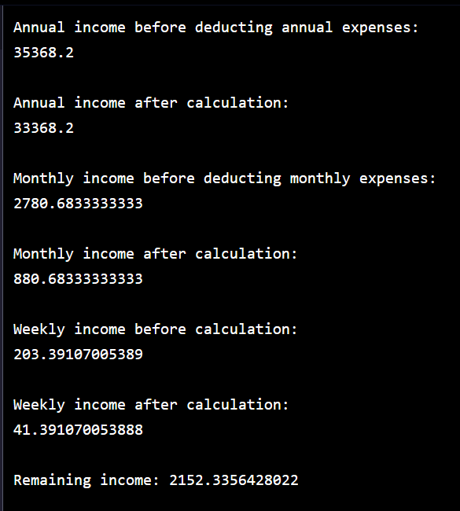

[](https://www.codecademy.com/paths/php-skill/tracks/php-arrays-and-loops/modules/learn-php-arrays-sp/projects/bobs-budget)
<br><br>


# Bob's Budget

# 1. Introduction:
Practice everything you’ve learned so far about writing PHP programs.
  
# 2. Output:



# 3. Prompts:

> 1. Bob just got a new job and needs help figuring out his budget!<br><br>
He has a salary, annual expenses, monthly expenses, and weekly expenses. He wants to know how much of his salary he can plan to save over the course of a year.<br><br>
The offer letter from his job has a salary listed before taxes of 48,150. We have stored this value in <b>$grossSalary</b>.<br><br>
Where Bob lives, there is a progressive tax system. He pays 12% (keeps 88%) on the first 9,700, 22% (keeps 78%) on the next 29,775, and pays 24% (keeps 76%) on the remainder of his salary. This data is stored in <b>$incomeSegments</b>.<br><br>
<b>$incomeSegments</b> is an array that contains an array for each income segment with the amount being taxed and the percent that he gets to keep.<br><br>
Let’s begin calculating Bob’s annual salary after taxes.<br><br>
Use <b>$incomeSegments</b> to calculate Bob’s <b>$netIncome</b> after this set of taxes.<br><br>
You should be summing the products of each portion of the taxes. The first portion is 8,536 (9,700 * 0.88).


```php
$netIncome = ($incomeSegments[0][0] * $incomeSegments[0][1]) + ($incomeSegments[1][0] * $incomeSegments[1][1]) + ($incomeSegments[2][0] * $incomeSegments[2][1]);
```
<br>

> 2. Bob also has a social security tax that is a percentage of his total salary. This amount is stored in <b>$socialSecurity</b>. Subtract this from <b>$netIncome</b>.<br><br>
Store the annual income after taxes in <b>$annualIncome</b> and print it to the screen.

```php
$netIncome -= $socialSecurity;
$annualIncome = $netIncome;
echo "Annual income before deducting annual expenses:\n$annualIncome\n";
```
<br>

> 3. Bob has two annual expenses for vacations and car repairs. These are stored in <b>$annualExpenses</b>.<br><br>
<b>$annualExpenses</b> is an associative array with the keys <b>'vacations'</b> and <b>'carRepairs'</b>.<br><br>
Subtract each of these from $annualIncome and print the resulting amount to the screen.

```php
$annualIncome -= $annualExpenses["vacations"];
$annualIncome -= $annualExpenses["carRepairs"];
 
echo "\nAnnual income after calculation:\n$annualIncome\n";
```
<br>

> 4. Before deducting Bob’s monthly expenses, determine his <b>$monthlyIncome</b> from the current <b>$annualIncome</b>.<br><br>
Print this value to the screen.
```php
$monthlyIncome = $annualIncome / 12;
 
echo "\nMonthly income before deducting monthly expenses:\n$monthlyIncome\n";
```
<br>

> 5. Bob has three monthly expenses. These are stored in <b>$monthlyExpenses</b> with the keys:
>> - <b>'rent'</b><br><br>
>> - <b>'utilities'</b><br><br>
>> - <b>'healthInsurance'</b><br><br>
Deduct these from <b>$monthlyIncome</b> and print the result to the screen.

```php
$monthlyIncome -= $monthlyExpenses["rent"];
$monthlyIncome -= $monthlyExpenses["utilities"];
$monthlyIncome -= $monthlyExpenses["healthInsurance"];
 
echo "\nMonthly income after calculation:\n$monthlyIncome \n";
```
<br>

> 6. Before deducting Bob’s weekly expenses, determine his <b>$weeklyIncome</b> from the current <b>$monthlyIncome</b>. (assume an average of 4.33 weeks in a month for this exercise)<br><br>
Print this value to the screen.

```php
$weeklyIncome = $monthlyIncome / 4.33;
 
echo "\nWeekly income before calculation:\n$weeklyIncome\n";
```
<br>


> 7. This time, you will be creating the array with Bob’s <b>$weeklyExpenses</b>. Use the following expenses:<br><br>
>>- gas: 25<br><br>
>>- food: 90<br><br>
>>- entertainment: 47<br><br>
>> Create this array.

```php
$weeklyExpenses = [
    "gas" => 25,
    "food" => 90,
    "entertainment" => 47
];
```
<br>

> 8. Deduct the weekly expenses from <b>$weeklyIncome</b> and print the result to the screen.
```php
$weeklyIncome -= $weeklyExpenses["gas"];
$weeklyIncome -= $weeklyExpenses["food"];
$weeklyIncome -= $weeklyExpenses["entertainment"];
 
echo "\nWeekly income after calculation:\n$weeklyIncome\n";
```

<br>

> 9. You’ve deducted all of Bob’s taxes and expenses at this point and have an amount that he is able to save each week in <b>$weeklyIncome</b>.<br><br>
Multiply this by 52 to determine how much he can save for the year and print it to the screen.
```php
$leftoverMoney = $weeklyIncome * 52;
 
echo "\nRemaining income: $leftoverMoney";
```