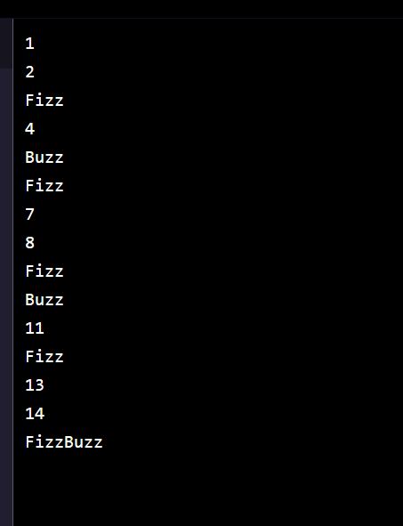

[](https://www.codecademy.com/paths/php-skill/tracks/php-arrays-and-loops/modules/learn-php-loops-sp/projects/php-fizzbuzz)
<br><br>


# FizzBuzz

# 1. Introduction:
FizzBuzz is one of the most commonly used interview questions for applicants to programming positions. Each interviewer has their own variant, but the prompt is usually something like:

```php
Write code that prints the numbers from 1 to 100 (inclusive), except for these cases:
- If a number is a multiple of 3, write "Fizz".
- If a number is a multiple of 5, write "Buzz".
- If a number is a multiple of both 3 and 5, write "FizzBuzz".
```

# 2. Output:




# 3. Prompts:

> 1. There are many ways to solve this problem using PHP. Let’s start by using a <b>while</b> loop to count from <b>1</b> to <b>100</b>.<br><br>
For now, create a <b>$counter</b> variable to keep track of the number and print it to the screen on each iteration.<br><br>
Make sure to put a newline before the end of each iteration.<br><br>
You’ll also need to increment your <b>$counter</b> variable within the code block.
```php
$counter = 1;
while ($counter <= 100) {
  echo $counter;
  echo "\n";
  $counter++;
}
```

<br>

> 2. Within the loop, establish some <b>if</b>, <b>elseif</b>, <b>else</b> statements to determine what to print at each iteration.<br><br>
Despite the order that the interviewer introduces the various conditions, you actually need to check for numbers divisible by <b>15</b> first. If you check first for divisible by <b>3</b>, you will print <b>"Fizz"</b> and skip past the <b>elseif</b> check for <b>15</b>.<br><br>
Remember to use the modulo operator (<b>%</b>) to check if a number is divisible by another. The modulus is <b>0</b> when two numbers are divisible.
```php
while ($counter <= 100) {
  if ($counter % 15 === 0) {
 
  } elseif ($counter % 3 === 0) {
 
  } elseif ($counter % 5 === 0) {
 
  } else {
 
  }
  echo $counter;
  echo "\n";
  $counter++;
}
```

<br>

> 3. Move the echo <b>$counter</b>; line inside the correct conditional statement. Remember, we only print the number if none of the other conditions are met.

```php
} else {
  echo $counter;
}
```

> 4. Place statements within the other three conditionals for <b>"FizzBuzz"</b>, <b>"Fizz"</b>, and <b>"Buzz"</b>.<br><br>
Your code should now print the complete output for <b>FizzBuzz</b>!
```php
# while loop
$counter = 1;
while ($counter <= 100) {
  if ($counter % 15 === 0) {
    echo "FizzBuzz";
  } elseif ($counter % 3 === 0) {
    echo "Fizz";
  } elseif ($counter % 5 === 0) {
    echo "Buzz";
  } else {
    echo $counter;
  }
  echo "\n";
  $counter++;
}
```

<br>

> 5. Let’s implement the solution again, but this time we will make use of a <b>for</b> and a <b>foreach</b> loop.<br><br>
Instead of printing the statements at each step, we will queue them up into an array and print them all out at the end.<br><br>
Begin by creating an empty array <b>$output</b> to store the statements in.

```php
$output = [];
```
<br>

> 6. Add a <b>for</b> loop that counts from <b>1</b> to <b>100</b>. Use <b>$i</b> as your loop counter variable.
```php
for ($i = 1; $i <= 100; $i++) {
 
}
```

<br>

> 7. Add conditions within your <b>for</b> loop to determine what to add to the output at each iteration. These should be the same as before, using the modulus <b>(%)</b> operator.
```php
if ($i % 15 === 0) {
 
} elseif ($i % 3 === 0) {
 
} elseif ($i % 5 === 0) {
 
} else {
 
}
```

> 8. Instead of adding <b>echo</b> statements inside each conditional, push the appropriate statement onto the <b>$output</b> array.<br><br>
You can use the built in function <b>array_push</b> for this.
```php
if ($i % 15 === 0) {
  array_push($output, "FizzBuzz");
} elseif ($i % 3 === 0) {
  array_push($output, "Fizz");
} elseif ($i % 5 === 0) {
  array_push($output, "Buzz");
} else {
  array_push($output, $i);
}
```

<br>

> 9. You now have an <b>$output</b> array with the correct print statements, but it’s not formatted very nice. Let’s use a <b>foreach</b> loop to iterate through it and print out the statements.<br><br>
Create a <b>foreach</b> loop that iterates through <b>$output</b>. Use <b>$value</b> for the variable at each position in the array.
```php
foreach ($output as $value) {
  echo $value . "\n";
}
```

<br>

> 10. Print the <b>$value</b> at each <b>loop</b> iteration followed by a newline.<br><br>
This should match the output from the <b>while</b> loop implementation.
<br><br>

> 11. Having the output stored in an array is nice since we can re-print the same output but add new conditions.<br><br>
Create a copy of the previous <b>foreach</b> loop that iterates over <b>$output</b>.

<br><br>

> 12. The interviewer has asked that now you avoid printing anything when a number is divisible by <b>3</b> (<b>"Fizz"</b>).<br><br>
Add an <b>if</b> and a <b>continue</b> statement to avoid printing anything when the <b>$value</b> is <b>"Fizz"</b>.<br><br>
When you scroll to the bottom, your last output should only have numbers, <b>"Buzz"</b>, and <b>"FizzBuzz"</b>.

```php
foreach ($output as $value) {
  if ($value === "Fizz") {
    continue;
  }
  echo $value . "\n";
}
```

<br>

> 13. As a final step, the interviewer has asked that now you stop printing values after the first <b>"FizzBuzz"</b>.<br><br>
Add an <b>elseif</b> statement to your conditional. Within it, it should print the <b>$value</b> and exit from the loop.

```php
foreach($output as $value2){
  if($value2 === "Fizz"){
     continue;
  }elseif($value2 === "FizzBuzz"){
     echo $value2;
     break;
  }else{
     echo $value2 ."\n";
  }
}
```