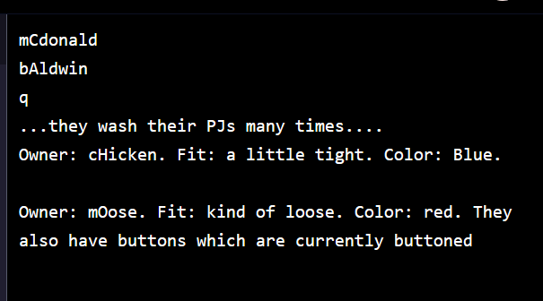
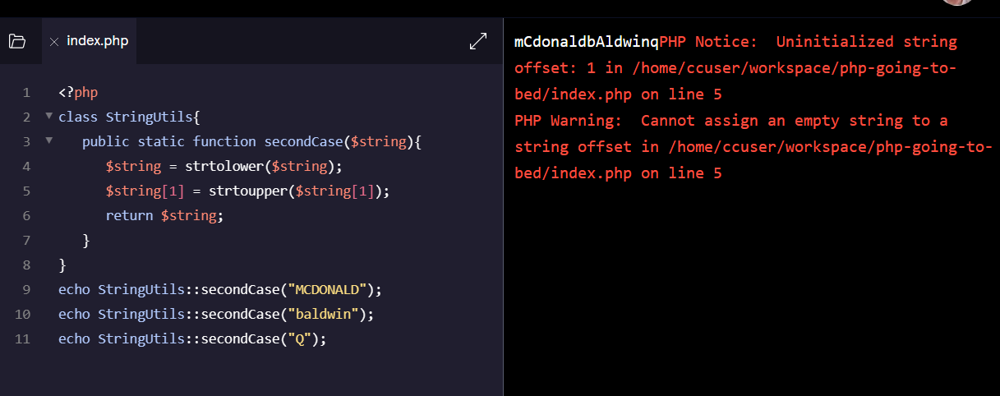
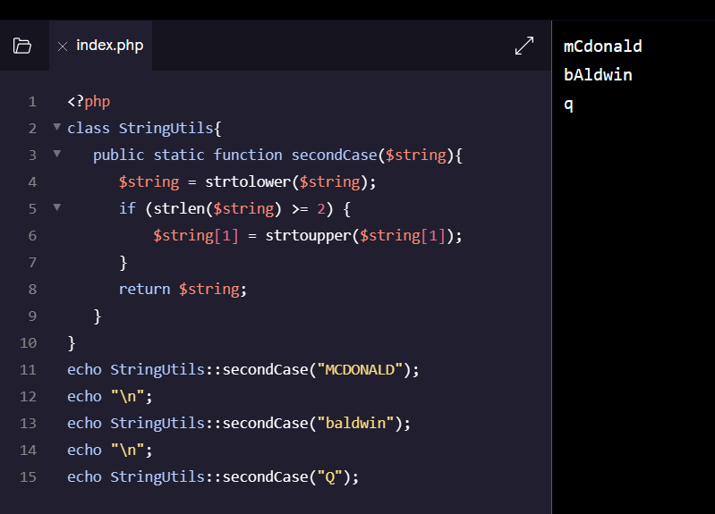

[](https://www.codecademy.com/paths/php-skill/tracks/php-classes-and-objects/modules/learn-php-classes-and-objects-in-php/projects/php-going-to-bed)
<br><br>


# Going to Bed

# 1. Introduction:
This project provides practice for:

- Creating objects from classes
- Writing and using methods
- Using static methods
# 2. Output:



# 3. Prompts:

> 1. In this project we will be creating some pajamas for barnyard animals. The farmer has a special way that she likes names formatted. To ensure this, we are going to build our own string function similar to PHP’s built in <b>strtolower</b> or <b>strtoupper</b>.<br><br>
We’re going to put this function inside of a helper class <b>StringUtils</b> (making it a method). We can then add other string utilities or reuse this class in another project for the same farmer.<br><br>
Begin by creating a <b>StringUtils</b> class.
```php
class StringUtils{
    
}
```
    
<br>

> 2. The farmer likes names to be entirely lowercase, except for the second letter, which should always be uppercase.<br><br>
Define a method called <b>secondCase</b> inside of <b>StringUtils</b> which accomplishes this. This method should be <b>static</b> since we won’t be instantiating <b>StringUtils</b>. We are only using it as a helper class.
```php
public static function secondCase($string) {
  $string = strtolower($string);
  $string[1] = strtoupper($string[1]);
  return $string;
}
```

<br>

> 3. Test this method by invoking it statically with some strings and printing the results to the screen. There is a case that causes an error, can you find it?
```php
//try
echo StringUtils::secondCase("MCDONALD");
echo StringUtils::secondCase("baldwin");
echo StringUtils::secondCase("Q");
```

<br>

> 4. While “Q” might not be a popular name, we might use <b>StringUtils</b> in a different application in the future and our method should handle single characters gracefully.<br><br>
Modify <b>secondCase</b> so that it does not generate an error for:
```php
echo StringUtils::secondCase("Q"); #should print "q"
echo StringUtils::secondCase(""); #should print an empty string

/*There are a couple of ways to accomplish this. We wrapped the upper casing in a conditional:*/

if (strlen($string) >= 2) {
  $string[1] = strtoupper($string[1]);
}
```

<br>

> 5. Now that we have our helper class, we are ready to start making pajamas.
<br><br>
Create a <b>Pajamas</b> class. It should have 3 private properties:
<br><br>
>> - <b>owner</b>
>> - <b>fit</b>
>> - <b>color</b>

```php
/*You can declare the properties on 3 separate lines or combine them into one statement like this:*/

class Pajamas
{
  private $owner, $fit, $color;
}
```

<br>

> 6. Add a constructor class for <b>Pajamas</b>. It should allow 3 arguments to be passed in corresponding to the 3 properties we just defined.<br><br>
Provide defaults for each argument (of your choosing).<br><br>
Make sure to assign the passed in values to their corresponding properties. Use <b>secondCase</b> in the <b>StringUtils</b> helper class to ensure that the <b>owner</b> property is properly formatted.
```php
/*The argument names don’t have to match the property names, but it can be a bit more straightforward:*/

function __construct(
  $owner = "unclaimed",
  $fit = "fine",
  $color = "white"
) {
  $this->owner = StringUtils::secondCase($owner);
  $this->fit = $fit;
  $this->color = $color;
}
```

<br>

> 7. We want to be able to describe each <b>Pajamas</b> object.<br><br>
Add a public <b>describe</b> method which returns a string using the 3 properties to tell us about the object.
```php
// We went with:

public function describe() {
  return "$this->owner's $this->color pajamas fit $this->fit.";
}
```

<br>

> 8. Now we have enough that we can begin testing our class out. Create an instance of the <b>Pajamas</b> class for <b>“CHICKEN”</b>. Assign it to the variable <b>chicken_PJs</b>. Use your favorite color and fit.<br><br>
Print the result of using the describe method on <b>chicken_PJs</b>.
```php
/*Depending on your implementation of describe, this code:*/

$chicken_PJs = new Pajamas("CHICKEN", "just right", "purple");
echo $chicken_PJs->describe();

/*Should print something like:

cHicken's purple pajamas fit just right.*/
```

<br>

> 9. Let’s say something happened to chicken’s pajamas to change the fit. Like maybe they were washed many times and shrunk. Since <b>fit</b> is a private property, we need to make a setter.<br><br>
Create a public method <b>setFit</b> which can be used to modify the fit of the pajamas.
```php
/*We can assign the passed in value to the fit property:*/

public function setFit($new_fit) {
  $this->fit = $new_fit;
}
```

<br>

> 10. Now test the <b>setFit</b> method by tightening up chicken’s PJs. Be sure to print the result.
```php
// We tested it with:

echo "\n...they wash their PJs many times....";
$chicken_PJs->setFit("a little tight");
echo "\n";
echo $chicken_PJs->describe();
```

<br>

> 11. Some animals need their pajamas to have buttons so that they can put them on.<br><br>
Create a new class <b>ButtonablePajamas</b> that inherits from <b>Pajamas</b>.
```php
class ButtonablePajamas extends Pajamas
{
 
}
```

<br>

> 12. We’ll need a new private property, <b>button_state</b>, to maintain the status of the buttons (“buttoned” or “unbuttoned”).<br><br>
Add this property to <b>ButtonablePajamas</b> and set it to <b>"unbuttoned"</b>.
```php
private $button_state = "unbuttoned";
```

<br>

> 13. The <b>describe</b> method makes no mention of buttons, but it seems like the right place for a message about the buttons.<br><br>
Within <b>ButtonablePajamas</b>, override the <b>describe</b> method. The version for this class should include a statement about whether the pajamas are buttoned or not.<br><br>
Remember that you can reuse the parent method with <b>parent::describe()</b> and concatenate the statement about the buttons.
```php
public function describe() {
  return parent::describe() . " They also have buttons which are currently $this->button_state.";
}
```

<br>

> 14. Let’s test this class on an animal that definitely needs buttons. Create an instance of <b>ButtonablePajamas</b> with the owner <b>"moose"</b> and save it to the variable <b>$moose_PJs</b>.<br><br>
Use the <b>describe</b> method to ensure that it let’s us know the pajamas are unbuttoned.
```php
/*We chose “kind of loose” as the fit and “red” as the color.*/

$moose_PJs = new ButtonablePajamas("moose", "kind of loose", "red");
echo "\n";
echo $moose_PJs->describe();
```

<br>

> 15. Moose would like to close his pajamas, but <b>button_state</b> is private. Create a method <b>toggleButtons</b> that flips the state of the buttons. It should take no arguments.
```php
/*There are a few ways to approach this. Here we are checking the button_state and switching it to the opposite state:*/

public function toggleButtons() {
  if ($this->button_state === "unbuttoned") {
    $this->button_state = "buttoned";
  } else {
    $this->button_state = "unbuttoned";
  }
}
```

<br>

> 16. Make sure to check that this method works as expected. Print the result.
```php
/*Since the pajamas start unbuttoned, the following code should button the pajamas and let us know:*/

$moose_PJs->toggleButtons();
echo "\n";
echo $moose_PJs->describe();
```

<br>

> 17. Congratulations on creating some object oriented pajamas!<br><br>
If you’d like additional practice, you can keep expanding the project. Here are some ideas:<br><br>
>>> - A class of pajamas that has a hat<br><br>
>>> - Performing validation on <b>setFit</b> to only allow “tight”, “fine”, and “loose”<br><br>
>>> - Setter and getter methods for the <b>owner</b> and <b>color</b> properties
