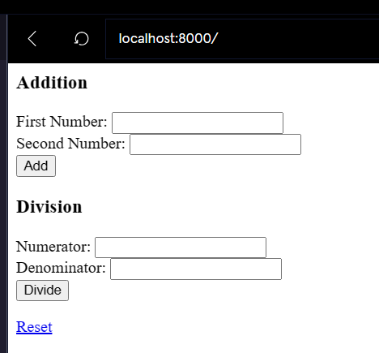
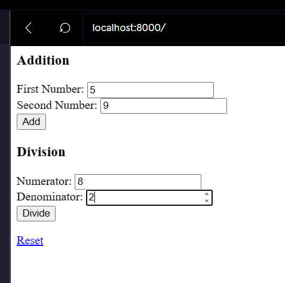
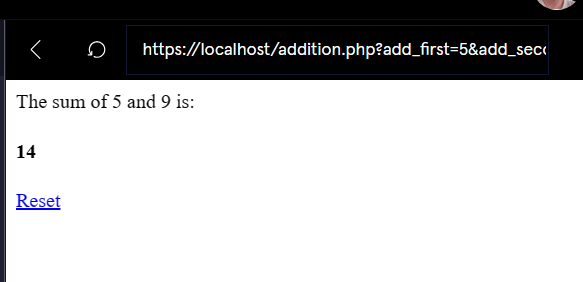
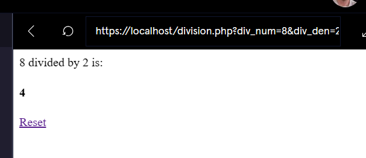

[](https://www.codecademy.com/paths/php-skill/tracks/php-and-html/modules/learn-php-html-forms-sp/projects/html-php-calculator)
<br><br>


# HTML - PHP Calculator

# 1. Introduction:
In this project, you’ll use PHP and HTML to build a calculator. You’ll create a front-end in HTML with forms and handle the math on the back-end with PHP.

# 2. Output:








# 3. Prompts:

> 1. You are going to build a calculator to do addition and division of two integer numbers.<br><br>
Each calculator will appear as a separate form for the user on the initial page, which will be contained in <b>index.php</b>. <br><br>
Begin by creating the two forms. Give each one a heading stating what the calculator will do. Be sure to include two number inputs for each form and a submit button.<br><br>
Don’t worry about giving the inputs names or the form actions in this step.
```html
 <!-- There are a number of ways that you could create these forms. Here is our example: -->

<h3>Addition</h3>
<form>
First Number: <input type="number"><br>
Second Number: <input type="number"><br>
<button type="submit">Add</button><br>
</form>
<h3>Division</h3>
<form>
Numerator: <input type="number"><br>
Denominator: <input type="number"><br>
<button type="submit">Divide</button><br>
</form>
```
<br>

> 2. Each form needs to be submitted to its own file on the back-end so that the correct math gets performed with the two numbers.<br><br>
We’ve already created <b>addition.php</b> and <b>division.php</b> for you.<br><br>
Update your forms so that each one gets submitted to the correct back-end file.<br><br>
For the addition form, set <b>action="addition.php"</b>.<br><br>
For the division form, set <b>action="division.php"</b>.

<br>

> 3. We need to decide which method to use for our forms. Since we’d like to be able to share our calculations with friends via URL, let’s use GET as the form method.<br><br>
Set this on both forms. <br><br>
Technically, GET is the default for HTML forms, but it’s a best practice to set it explicitly:<br><br>
```html
<form method="get">
```

<br>

> 4. To enable processing the inputs with PHP, give each input a unique name.
```html
<!-- Use the name attribute on the inputs to set unique names.

Here are the forms so far:
-->


<h3>Addition</h3>
<form action="addition.php" method="get">
First Number: <input type="number" name="add_first"><br>
Second Number: <input type="number" name="add_second"><br>
<button type="submit">Add</button><br>
</form>

<h3>Division</h3>
<form action="division.php" method="get">
Numerator: <input type="number" name="div_num"><br>
Denominator: <input type="number" name="div_den"><br>
<button type="submit">Divide</button><br>
</form>
```

<br>

> 5. At this point, you may want to print the contents of the appropriate superglobal within both <b>addition.php</b> and <b>division.php</b> to make sure that your data is making it to the backend.<br><br>
If it is not, make sure that each form action is set to the corresponding file and that the inputs have names.
```php
//  Add this line to addition.php and division.php:

<?php print_r($_GET)?>
```

<br>

> 6. Now, try printing just the correct result within <b>addition.php</b>.
```php
// This can be done using the + operator:

<?=$_GET['add_first']+$_GET['add_second']?>
```

<br>

> 7. Update <b>addition.php</b> to have a more helpful message including what numbers were added.<br><br>
You can play around with the styling to get it how you like it.
```php
<?="The sum of ${_GET['add_first']} and ${_GET['add_second']} is:"?>
<h4><?=$_GET['add_first']+$_GET['add_second']?></h4>
```

<br>

> 8. Now, implement the back-end processing for <b>division.php</b>.
```php
<?="${_GET['div_num']} divided by ${_GET['div_den']} is:"?>
<h4><?=$_GET['div_num']/$_GET['div_den']?></h4>
```

<br>

> 9. If you would like more of a challenge, you could:<br><br>
>>- Implement more complicated math operations, like the [Pythagorean theorem](https://en.wikipedia.org/wiki/Pythagorean_theorem). The calculator could return the length of a hypotenuse given the two other sides.<br><br>
>>- Add more CSS styling to the application.<br><br>
>>- Combine the two forms into a single form. To submit the forms to the correct file, use the [<b>formaction</b> attribute](https://www.w3schools.com/tags/att_button_formaction.asp)


