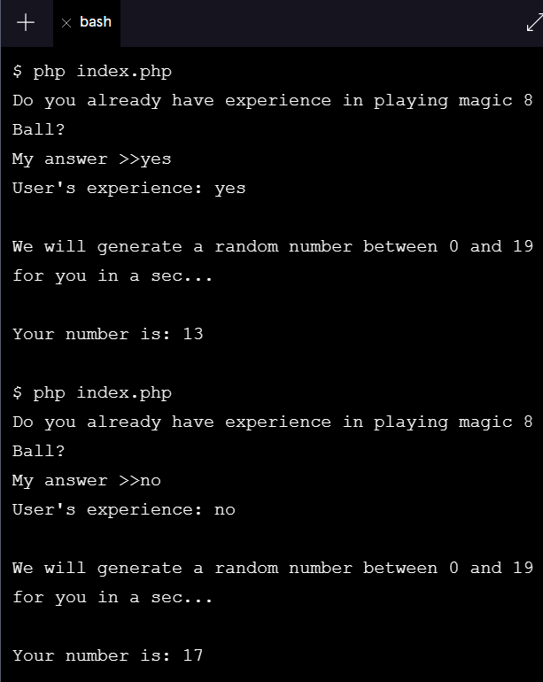
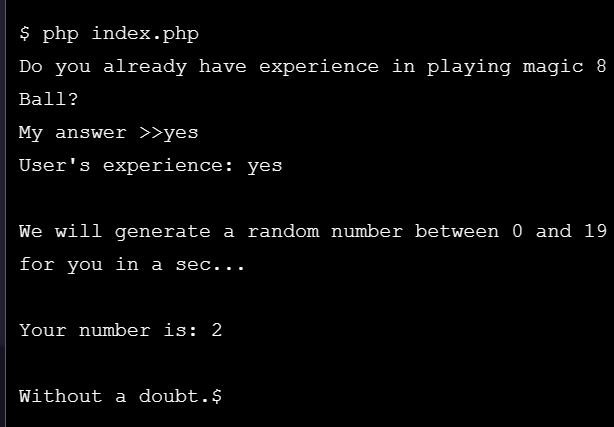
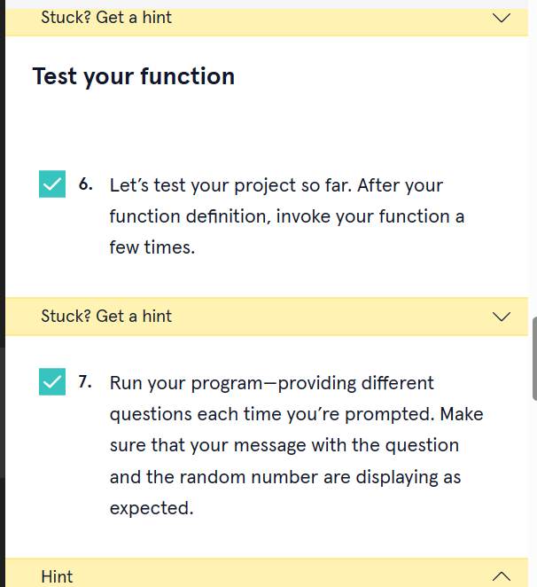
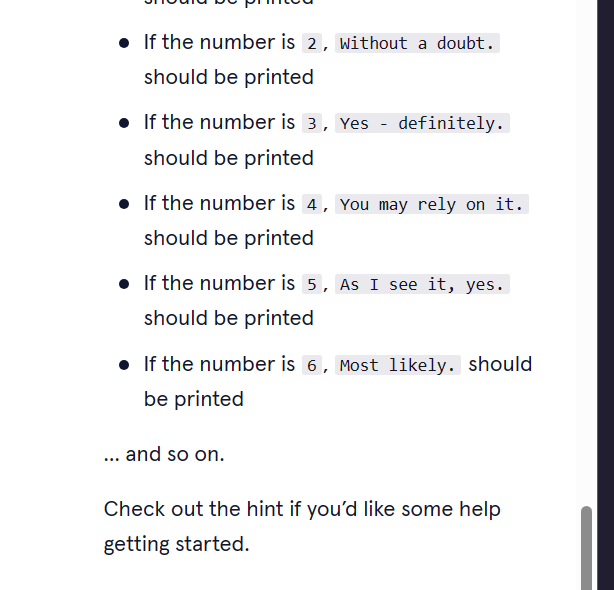
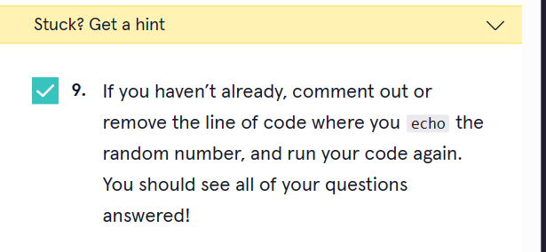
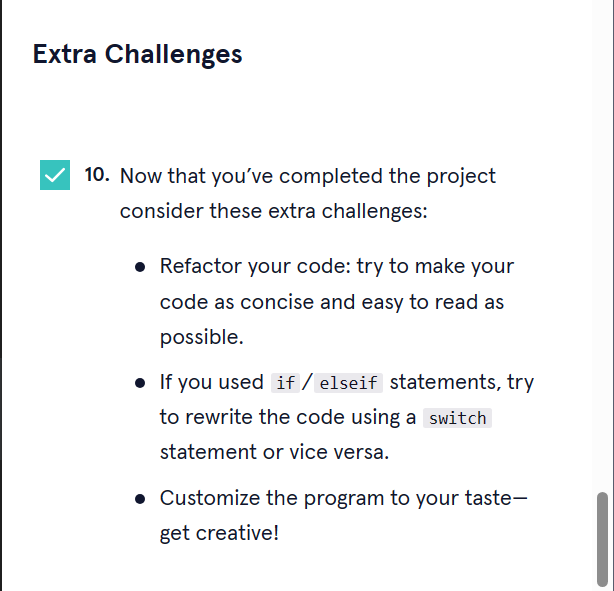

  

# Magic 8 Ball

# 1. Introduction:
The [Magic 8-Ball](https://en.wikipedia.org/wiki/Magic_8_Ball) is a popular toy used for fortune-telling or seeking advice.

In this project, you’ll be creating a function that can answer any “yes” or “no” question.

The answers inside a standard Magic 8-Ball are:

+ It is certain.
  

+ It is decidedly so.
  

+ Without a doubt.
  

+ Yes - definitely.
  

+ You may rely on it.
  

+ As I see it, yes.
  

+ Most likely.
  

+ Outlook good.
  

+ Yes.
  

+ Signs point to yes.
  

+ Reply hazy, try again.
  

+ Ask again later.
  

+ Better not tell you now.
  

+ Cannot predict now.
  

+ Concentrate and ask again.
  

+ Don't count on it.
  

+ My reply is no.
  

+ My sources say no.
  

+ Outlook not so good.
  

+ Very doubtful.
  

Your magic8Ball() will take in any “yes” or “no” question (as a string) and give a psychic (random) answer.

# 2. Output:

# 3. Prompts:

