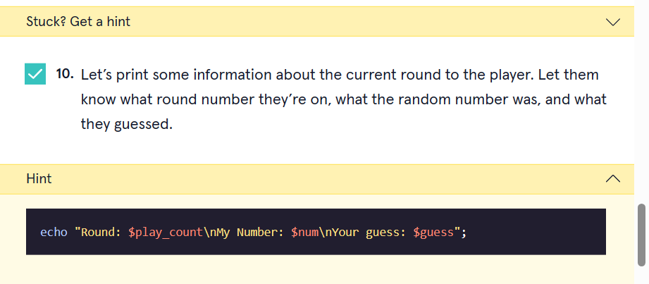
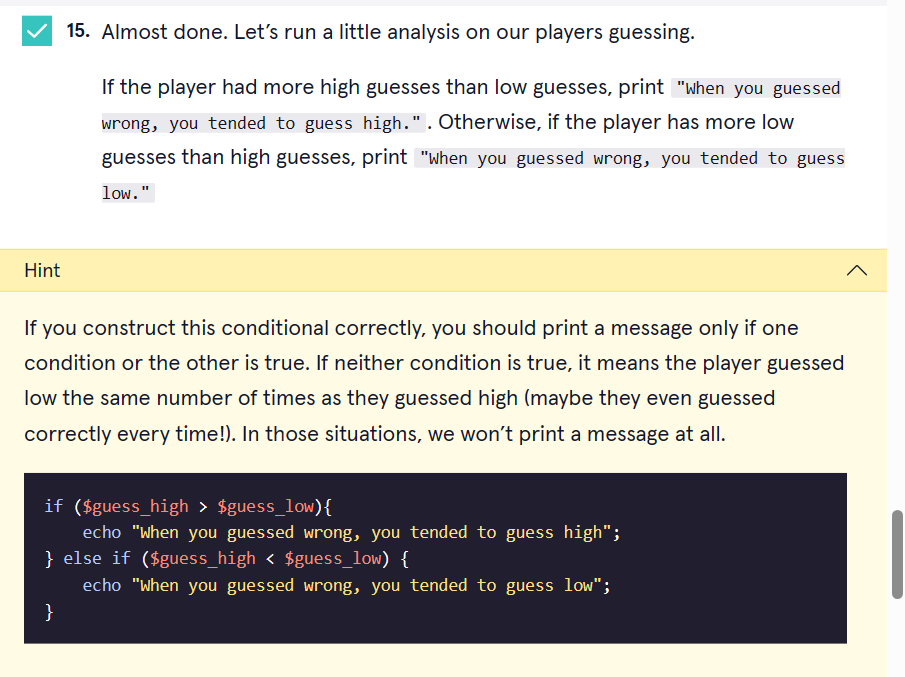

  

# PHP Number Guessing

# 1. Introduction:
In this project, you’ll create a number guessing game. Your program will generate a random number between 1 and 10. You’ll run the game 10 times and tell the user some information about their guessing abilities.

# 2. Output:

# 3. Prompts:

