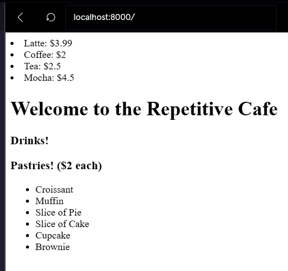

[](https://www.codecademy.com/paths/php-skill/tracks/php-and-html/modules/learn-php-php-and-html-sp/projects/repetitive-cafe)
<br><br>


# Repetitive Cafe

# 1. Introduction:
Make use of some of the PHP loop shorthand to create HTML for a restaurant menu. Practice using the different loop types with HTML.

# 2. Output:



# 3. Prompts:

> 1. This is a menu page for the cafe. We are going to add some drinks which are uniquely priced and some pastries which each sell for $2.<br><br>
We’re going to store the names and prices (for drinks) of the items in PHP and embed PHP in our HTML to display them.<br><br>
Begin by creating a PHP section at the top of the file to store the item details.<br><br>
Create an array <b>$drinks</b> and populate it with several drinks you’d like to serve in your cafe. The name of the drink should be the key and the price should be the value.
```php
<?php
$drinks = [
  "Latte" => 3.99,
  "Coffee" => 2.00,
  "Tea" => 2.50,
  "Mocha" => 4.50
];
?>
```

<br>

> 2. Add a list of pastries to serve in your cafe. Since they are all $2, there is no need to add prices.
```php
$pastries = [
  "Croissant",
  "Muffin",
  "Slice of Pie",
  "Slice of Cake",
  "Cupcake",
  "Brownie"
];
```

<br>

> 3. Within the `<ul>` section under drinks, create a <b>foreach</b> loop using the shorthand syntax. It should iterate over the items in <b>$drinks</b> and provide access to the keys and values.
```php
// One approach (you can use your own variables for $drink and $price:

<?php foreach($drinks as $drink=>$price):?>
<?php endforeach;?>
```
<br>

> 4. Within that <b>foreach</b> loop, add an <b>li</b> element for each <b>drink</b> item.
```php
// The li element goes inside the loop:

<?php foreach($drinks as $drink=>$price):?>
<li></li>
<?php endforeach;?>
```
<br>

> 5. Within the <b>li</b> element, re-enter PHP mode to print the name of the drink and the price. Feel free to use your local currency.
```php
foreach($drinks as $keys => $values):
?>
<li><?=$keys.": $".$values?></li>
<?php endforeach;?>
```

<br>

> 6. Next, we need to add our list of pastries to the menu.<br><br>
Begin by adding a <b>for</b> loop within the <b>ul</b> element under the “Pastries!” heading. The loop variable should be initialized to 0 and increment at each loop iteration.
```php
<ul>
<?php for($i=0;$i<count($pastries); $i++):?>
 
<?php endfor;?>
</ul>
```

<br>

> 7. We are going to use the loop variable to access elements within <b>$pastries</b>, so we need the for loop to continue while our loop counter is less than the number of items in <b>$pastries</b>.<br><br>
Add this condition to your <b>for</b> loop.
```php
<ul>
<?php for($i=0; $i<count($pastries); $i++):?>
 
<?php endfor;?>
</ul>
```

<br>

> 8. Create an <b>li</b> element for each loop iteration.
```php
<ul>
<?php for($i=0; $i<count($pastries); $i++):?>
<li></li>
<?php endfor;?>
</ul>
```

<br>

> 9. Within the <b>li</b> element, use the loop variable to index into <b>$pastries</b> and print the name of each pastry.
```php
Our loop variable is $i, so we are indexing like so:

<ul>
<?php for($i=0; $i<count($pastries); $i++):?>
<li><?=$pastries[$i]?></li>
<?php endfor;?>
</ul>
```

<br>

> 10. Great! You now have a menu of drinks and pastries for the cafe. Note how you can easily update the arrays at the beginning of the file and the HTML website is updated accordingly.<br><br>
If you would like to keep practicing, try adding a food section to the menu and use a <b>while</b> loop to iterate over the items.<br><br>
Which loop type is the most readable for you?<br><br>
Which was the easiest to create for this type of application?<br><br>


