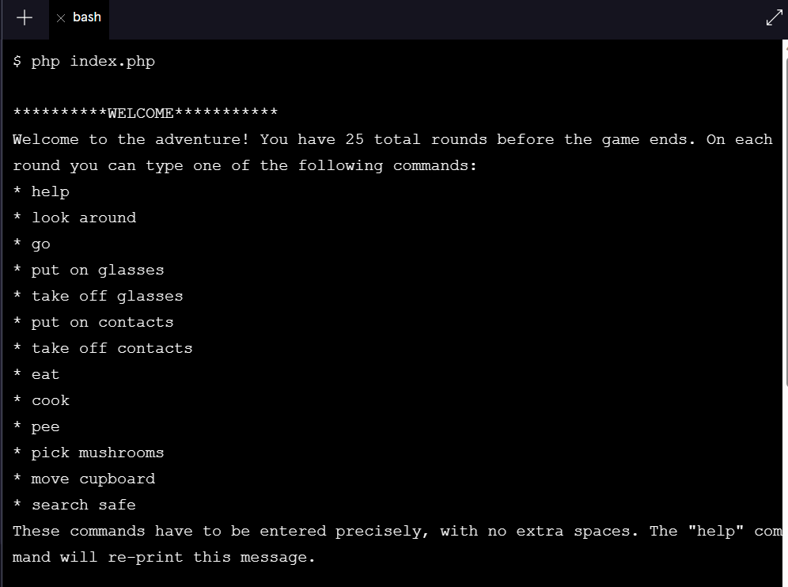
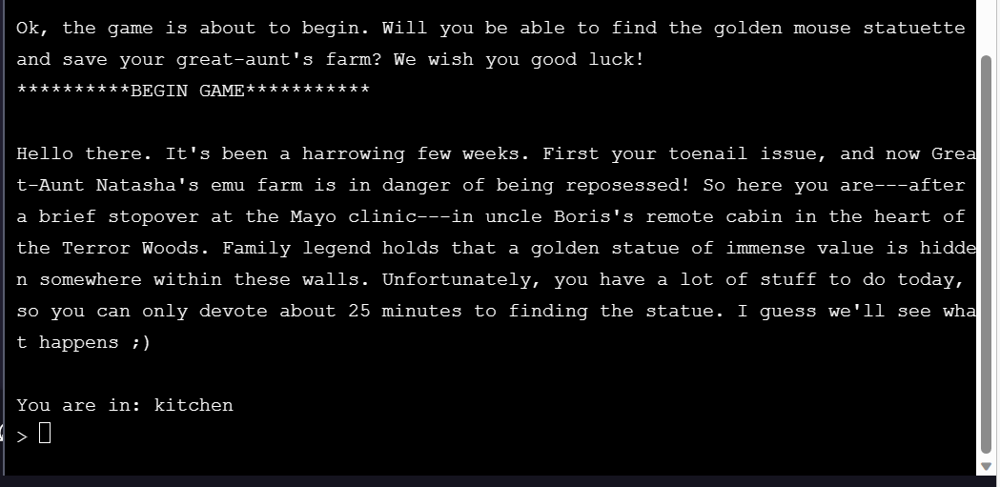

b[](https://www.codecademy.com/paths/php-skill/tracks/php-conditionals-and-logic/modules/learn-php-logical-operators-and-compound-conditions-sp/projects/save-the-farm)
<br><br>


# Save the Farm!

# 1. Introduction:
<i>Hello there. It’s been a harrowing few weeks. First your toenail issue, and now Great-Aunt Natasha’s emu farm is in danger of being repossessed! So here you are—after a brief stopover at the Mayo Clinic—in Uncle Boris’s remote cabin in the heart of the Terror Woods. Family legend holds that a golden statue of immense value is hidden somewhere within these walls…</i>

Welcome to the world of [interactive fiction](https://en.wikipedia.org/wiki/Interactive_fiction). In this project, you’ll be building a text adventure game called <b>Save the Farm!</b>

You’ll be practicing everything you’ve learned about booleans, conditionals, and logical operators to create a fun, silly game. You can customize the game to your taste. Once you’ve completed this project, you’ll understand the mechanics of building an interactive text game, so, from there, the world is your oyster (as Uncle Boris always used to say).

Take your time and have fun!

# 2. Output:






# 3. Prompts:

> 1. Learning how to read code is as important as learning to write code. To start this project, we’ll practice our code reading skills by walking through the existing code base (collection of existing code) for the game. You’ll use the skills you’ve been developing so far to understand the provided code. From there, you’ll be able to grow the program into something really powerful and fun! <br><br>
We’ve provided a lot of the structure and basic functionality for the game. The game program is located in the index.php file. <br><br>
The game isn’t very interesting yet (those are the parts you’ll be writing), but let’s run it to see what we have so far.<br><br>
Enter php index.php in the terminal.

<br>

> 2. At the start of the index.php file, we declare several global variables we’ll need throughout the game. Next we include in all of the helpful functions we’ll need to make the game work.<br><br>
Read through the directions that have been printed to the terminal. The list of commands is printed when the <span style="background-color:gray;color:black">getHelp()</span> function is invoked.<br><br>
You can see where the other parts are being printed with <span style="background-color:gray;color:black">echo</span> statements in index.php file. Next, we invoke the <span style="background-color:gray;color:black">gameRound()</span> function 25 times—once for each round of the game.<br><br>
Notice, that the terminal is awaiting user input.

<br>

> 3. Run through several commands in the terminal. <br><br>
You can type any of the valid commands <span style="background-color:gray;color:black">put on glasses</span>, <span style="background-color:gray;color:black">take off glasses</span>, <span style="background-color:gray;color:black">put on contacts</span>, <span style="background-color:gray;color:black">take off contacts</span>, <span style="background-color:gray;color:black">eat</span>, <span style="background-color:gray;color:black">cook</span>, <span style="background-color:gray;color:black">pee</span>, <span style="background-color:gray;color:black">pick mushrooms</span>, <span style="background-color:gray;color:black">move cupboard</span>, <span style="background-color:gray;color:black">look around</span>, <span style="background-color:gray;color:black">search safe</span>, <span style="background-color:gray;color:black">go</span>, or you can type an invalid command. <br><br>
Right now, only <span style="background-color:gray;color:black">help</span> and an invalid command should work as expected. The others should just use up a round. You’ll be writing the functions to make each of these commands meaningful.<br><br>
You can run through 25 commands to end the program or press control+c in the terminal to quit the program.

<br>

> 4. Now that we’ve seen how the program works broadly, let’s look at the details of the <span style="background-color:gray;color:black">gameRound()</span> function—this is where the real action happens.<br><br>
Navigate to the file gameRound.php in your code editor.
<br><br>
Scan through the <span style="background-color:gray;color:black">gameRound()</span> function on your own. In the next task, we’ll walk through it together.

<br>

> 5. Let’s walk through the function together: 
>>- First we declare all the <b>global</b> variables we’ll need to have access to within the function.<br><br>
>>- Next, we check how many rounds the player has left. Winning or losing the game eliminates all remaining rounds. So, even though we invoke the <b>gameRound()</b> function 25 times, we might not want it to do something every time it’s run. In those situations, we’ll simply <b>return</b> from the function.<br><br>
>>- We invoke the <b>printStatus()</b> function. You’ll be writing this function. Right now, it doesn’t do anything.<br><br>
>>- We prompt the user with <b>readline()</b> and save their response as <b>$cmd</b>.<br><br>
>>- We provide a large <b>switch</b> statement with many cases to handle the different commands a user may have entered. We’ll look over this in even more detail in the next step.<br><br>
>>- We use up a round by decreasing the <b>global</b> <b>$rounds_left</b> variable.<br><br>
>>- We end the function by printing a message to let the user know how many rounds they have left.

<br>

> 6. Let’s break down the <b>switch</b> statement in more detail:
>>- If the user types <b>help</b>, the <b>printHelp()</b> function runs. This function is located in <b>printHelp.php</b>.<br><br>
>>- The next several cases are similar to each other. For the commands <b>put on glasses</b>, <b>put on contacts</b>, <b>take off contacts</b>, and <b>take off glasses</b> the corresponding <b>global</b> variable is changed and a message is printed to the player confirming their action.<br><br>
>>- For the next 8 cases, you’ll be writing the functions that make them work:
>>>- If the command is <b>go</b>, the <b>changeLocation()</b> function, is run.<br><br>
>>>- If the command is <b>look around</b>, the <b>lookAround()</b> function, is run.<br><br>
>>>- If the command is <b>pee</b>, the <b>pee()</b> function, is run.<br><br>
>>>- If the command is <br>pick mushrooms</b>, the <b>pickMushrooms()</b> function, is run.<br><br>
>>>- If the command is <b>cook</b>, the <b>cookSoup()</b> function, is run.<br><br>
>>>- If the command is <b>eat</b>, the <b>eatSoup()</b> function, is run.<br><br>
>>>- If the command is <b>move cupboard</b>, the <b>moveCupboard()</b> function, is run.<br><br>
>>>- If the command is <b>search safe</b>, the <b>searchSafe()</b> function, is run.<br><br>
>>- We added a little [easter egg](https://en.wikipedia.org/wiki/Easter_egg_(media)): if the player is in the bathroom and enters <b>search toilet</b> they lose the game in a silly way.<br><br>
>>- Finally, there’s a <b>default</b> to catch any unrecognized commands.<br><br>

<br>

> 7. The first thing we need to do is write a <b>printStatus()</b> function. This function will print the player’s current state so that they can make an informed decision about what to do next.<br><br>
Navigate to the <b>printStatus.php</b> file. We’ve declared the <b>global</b> variables and added the first line of the function, which prints the player’s current location. But they need more information.

<br>

> 8. If the player is wearing contacts, you should print <b>"You are wearing contacts.\n"</b>.<br><br>
If the player is wearing glasses, you should print <b>"You are wearing glasses.\n"</b>.<br><br>
It may be silly, but there’s nothing to stop someone from wearing contacts and glasses, so we don’t do that in our game.

```php
  if($wearing_contacts){
     echo "You are wearing contacts.\n";
  }
  if($wearing_glasses){
     echo "You are wearing glasses.\n";
  }

```

<br>

> 9. Let’s do a few more:
>>- If the player has mushrooms, you should print <b>"You are holding mushrooms.\n"</b>.<br><br>
>>- If the player has soup, you should print <b>"You are holding a scalding-hot bowl of mushroom soup.\n"</b>.<br><br>
>>- If the player needs to pee, you should print <b>"You need to pee!\n"</b>.

```php
 if($has_mushrooms){
     echo "You are holding mushrooms.\n";
  }
  if($has_soup){
     echo "You are holding a scalding-hot bowl of mushroom soup.\n";
  }
  if($needs_to_pee){
     echo "You need to pee!\n";
  }
```

<br>

> 10. If the player is hungry, you should print <b>"You are hungry.\n"</b>. Otherwise, you should print <b>"You are well-fed and energetic.\n"</b>.

```php
  if($is_hungry){
    echo "You are hungry.\n";
  }else{
    echo "You are well-fed and energetic.\n";
  }
```

<br>

> 11. Test your function! Enter <b>php index.php</b> in the terminal again. Now you should see the player status print at the start of each round. Do some actions that should change their status (<b>put on glasses</b>, <b>put on contacts</b>, <b>take off contacts</b>, and <b>take off glasses</b>) and make sure everything is working as expected.

<br>

> 12. Our player starts out in the kitchen, but the game has multiple locations. From the kitchen, a player can enter the bathroom or go out to the woods. From each of those locations, they can get back to the kitchen. <br><br>
It’s time to write the <b>changeLocation()</b> function which will run when the player types <b>go</b>.<br><br>
Navigate to the <b>changeLocation.php</b> file. For this function, you’ll need access to the global <b>$location</b> variable, so declare that at the start of the function body.

```php
function changeLocation(){
    global $location;
 
}
```

<br>

> 13. After a player types go we still need to know where they want to go. We’ll need to prompt them with the <b>readline()</b> function.<br><br>
First you should print <b>"Where do you want to go?\n"</b>. Next, you should invoke <b>readline()</b> passing in <b>">>"</b> as the prompt string. We like using <b>></b> or <b>>></b> to prompt the player because it makes it clear where they’re expected to type.<br><br>
Save the player’s response as a variable.<br><br>
You might want to convert their response to lower-case to be more flexible. You can do this too with the built-in <b>strtolower()</b> function.

```php
function changeLocation(){
    global $location;
 
    echo "Where do you want to go?\n";
 
     $go_to = readline (">> ");
 
     $go_to = strtolower($go_to);
 
}
```

<br>

> 14. You’ll need to write several <b>if/elseif</b> conditions to handle the possible scenarios:<br><br>
>>- If their current location is kitchen and their command was to go to the bathroom, you should print <b>You go to: bathroom.\n</b>, and you should change their current location to <b>"bathroom"</b>.<br><br>
>>- If their current location is kitchen and their command was to go to the woods, you should print <b>You follow the winding path, shivering as you make your way deep into the Terror Woods.</b>, and and you should change their current location to <b>"woods"</b>.<br><br>
>>- If their current location is bathroom and their command was to go to the kitchen, you should print <b>You go to: kitchen.\n</b>, and you should change their current location to <b>"kitchen"</b>.<br><br>
>>- If their current location is woods and their command was to go to the kitchen, you should print <b>You go to: kitchen.\n</b>, and you should change their current location to <b>"kitchen"</b>.<br><br>
>>- Otherwise, if their command was to go to the woods or their command was to go to the kitchen or their command was to go to the bathroom, you should print <b>You can't go directly to there from your current location. Try going somewhere else first.\n</b>.<br><br>
>>- And finally, you should handle the situation where they didn’t enter a valid command, so you should print <b>That doesn't make sense. Are you confused? Try 'look around'.\n</b>.

```php
echo "\n";
  if($location === "kitchen" && $go_to === "bathroom"){
     echo "You go to: $go_to.\n";
     $location = $go_to;

  }elseif($location === "kitchen" && $go_to === "woods"){

     echo "You follow the winding path, shivering as you make your way deep into the Terror Woods.";
     $location = $go_to;

  }elseif($location === "bathroom" && $go_to === "kitchen"){
     echo "You go to: kitchen.\n";
     $location = $go_to;

  }elseif($location === "woods" && $go_to === "kitchen"){
     echo "You go to: kitchen.\n";
     $location = $go_to;

  }elseif($go_to === "woods" || $go_to === "kitchen" || $go_to === "bathroom"){
     echo "You can't go directly to there from your current location. Try going somewhere else first.\n";

  }else{
     echo "That doesn't make sense. Are you confused? Try 'look around'.\n";

  }
```

<br>

> 15. Test your function! Enter <b>php index.php</b> in the terminal again. Since you wrote the <b>printStatus()</b> function, you can see the player status print at the start of each round.<br><br>
Use the <b>go</b> command to test each of the actions you wrote within the <b>changeLocation()</b> function. Make sure everything is working as expected.<br><br>
When you type an invalid command, we tell the player to <b>look around…</b> but the <b>lookAround()</b> function isn’t actually written yet… let’s get on that!

