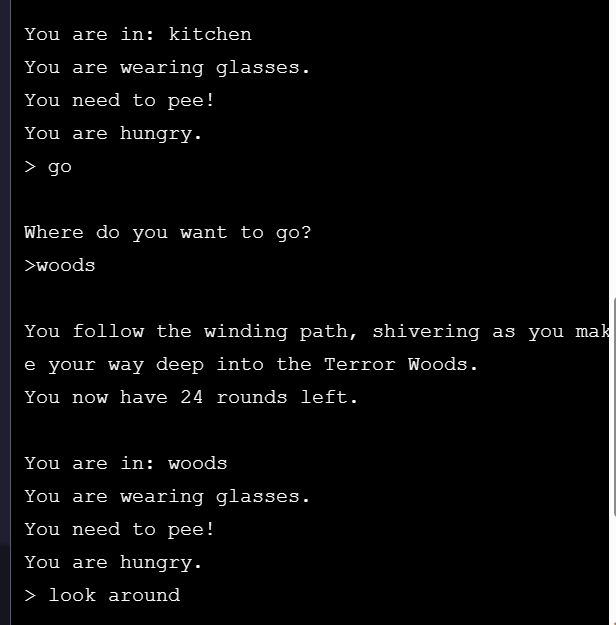
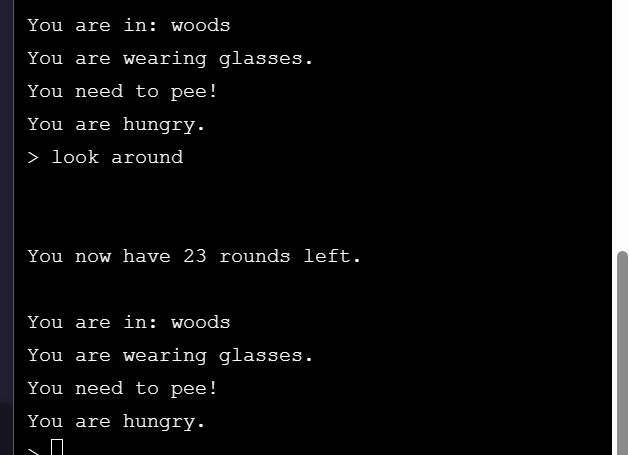

b[](https://www.codecademy.com/paths/php-skill/tracks/php-conditionals-and-logic/modules/learn-php-logical-operators-and-compound-conditions-sp/projects/save-the-farm)
<br><br>


# Save the Farm!

# 1. Introduction:
<i>Hello there. It’s been a harrowing few weeks. First your toenail issue, and now Great-Aunt Natasha’s emu farm is in danger of being repossessed! So here you are—after a brief stopover at the Mayo Clinic—in Uncle Boris’s remote cabin in the heart of the Terror Woods. Family legend holds that a golden statue of immense value is hidden somewhere within these walls…</i>

Welcome to the world of [interactive fiction](https://en.wikipedia.org/wiki/Interactive_fiction). In this project, you’ll be building a text adventure game called <b>Save the Farm!</b>

You’ll be practicing everything you’ve learned about booleans, conditionals, and logical operators to create a fun, silly game. You can customize the game to your taste. Once you’ve completed this project, you’ll understand the mechanics of building an interactive text game, so, from there, the world is your oyster (as Uncle Boris always used to say).

Take your time and have fun!

# 2. Output:






# 3. Prompts:

> 1. Learning how to read code is as important as learning to write code. To start this project, we’ll practice our code reading skills by walking through the existing code base (collection of existing code) for the game. You’ll use the skills you’ve been developing so far to understand the provided code. From there, you’ll be able to grow the program into something really powerful and fun! <br><br>
We’ve provided a lot of the structure and basic functionality for the game. The game program is located in the index.php file. <br><br>
The game isn’t very interesting yet (those are the parts you’ll be writing), but let’s run it to see what we have so far.<br><br>
Enter php index.php in the terminal.

<br>

> 2. At the start of the index.php file, we declare several global variables we’ll need throughout the game. Next we include in all of the helpful functions we’ll need to make the game work.<br><br>
Read through the directions that have been printed to the terminal. The list of commands is printed when the <b>getHelp()</b> function is invoked.<br><br>
You can see where the other parts are being printed with <b>echo</b> statements in index.php file. Next, we invoke the <b>gameRound()</b> function 25 times—once for each round of the game.<br><br>
Notice, that the terminal is awaiting user input.

<br>

> 3. Run through several commands in the terminal. <br><br>
You can type any of the valid commands <b>put on glasses</b>, <b>take off glasses</b>, <b>put on contacts</b>, <b>take off contacts</b>, <b>eat</b>, <b>cook</b>, <b>pee</b>, <b>pick mushrooms</b>, <b>move cupboard</b>, <b>look around</b>, <b>search safe</b>, <b>go</b>, or you can type an invalid command. <br><br>
Right now, only <b>help</b> and an invalid command should work as expected. The others should just use up a round. You’ll be writing the functions to make each of these commands meaningful.<br><br>
You can run through 25 commands to end the program or press <b>control+c</b> in the terminal to quit the program.

<br>

> 4. Now that we’ve seen how the program works broadly, let’s look at the details of the <b>gameRound()</b> function—this is where the real action happens.<br><br>
Navigate to the file gameRound.php in your code editor.
<br><br>
Scan through the <b>gameRound()</b> function on your own. In the next task, we’ll walk through it together.

<br>

> 5. Let’s walk through the function together: 
>>- First we declare all the <b>global</b> variables we’ll need to have access to within the function.<br><br>
>>- Next, we check how many rounds the player has left. Winning or losing the game eliminates all remaining rounds. So, even though we invoke the <b>gameRound()</b> function 25 times, we might not want it to do something every time it’s run. In those situations, we’ll simply <b>return</b> from the function.<br><br>
>>- We invoke the <b>printStatus()</b> function. You’ll be writing this function. Right now, it doesn’t do anything.<br><br>
>>- We prompt the user with <b>readline()</b> and save their response as <b>$cmd</b>.<br><br>
>>- We provide a large <b>switch</b> statement with many cases to handle the different commands a user may have entered. We’ll look over this in even more detail in the next step.<br><br>
>>- We use up a round by decreasing the <b>global</b> <b>$rounds_left</b> variable.<br><br>
>>- We end the function by printing a message to let the user know how many rounds they have left.

<br>

> 6. Let’s break down the <b>switch</b> statement in more detail:
>>- If the user types <b>help</b>, the <b>printHelp()</b> function runs. This function is located in <b>printHelp.php</b>.<br><br>
>>- The next several cases are similar to each other. For the commands <b>put on glasses</b>, <b>put on contacts</b>, <b>take off contacts</b>, and <b>take off glasses</b> the corresponding <b>global</b> variable is changed and a message is printed to the player confirming their action.<br><br>
>>- For the next 8 cases, you’ll be writing the functions that make them work:
>>>- If the command is <b>go</b>, the <b>changeLocation()</b> function, is run.<br><br>
>>>- If the command is <b>look around</b>, the <b>lookAround()</b> function, is run.<br><br>
>>>- If the command is <b>pee</b>, the <b>pee()</b> function, is run.<br><br>
>>>- If the command is <br>pick mushrooms</b>, the <b>pickMushrooms()</b> function, is run.<br><br>
>>>- If the command is <b>cook</b>, the <b>cookSoup()</b> function, is run.<br><br>
>>>- If the command is <b>eat</b>, the <b>eatSoup()</b> function, is run.<br><br>
>>>- If the command is <b>move cupboard</b>, the <b>moveCupboard()</b> function, is run.<br><br>
>>>- If the command is <b>search safe</b>, the <b>searchSafe()</b> function, is run.<br><br>
>>- We added a little [easter egg](https://en.wikipedia.org/wiki/Easter_egg_(media)): if the player is in the bathroom and enters <b>search toilet</b> they lose the game in a silly way.<br><br>
>>- Finally, there’s a <b>default</b> to catch any unrecognized commands.<br><br>

<br>

> 7. The first thing we need to do is write a <b>printStatus()</b> function. This function will print the player’s current state so that they can make an informed decision about what to do next.<br><br>
Navigate to the <b>printStatus.php</b> file. We’ve declared the <b>global</b> variables and added the first line of the function, which prints the player’s current location. But they need more information.

<br>

> 8. If the player is wearing contacts, you should print <b>"You are wearing contacts.\n"</b>.<br><br>
If the player is wearing glasses, you should print <b>"You are wearing glasses.\n"</b>.<br><br>
It may be silly, but there’s nothing to stop someone from wearing contacts and glasses, so we don’t do that in our game.

```php
  if($wearing_contacts){
     echo "You are wearing contacts.\n";
  }
  if($wearing_glasses){
     echo "You are wearing glasses.\n";
  }

```

<br>

> 9. Let’s do a few more:
>>- If the player has mushrooms, you should print <b>"You are holding mushrooms.\n"</b>.<br><br>
>>- If the player has soup, you should print <b>"You are holding a scalding-hot bowl of mushroom soup.\n"</b>.<br><br>
>>- If the player needs to pee, you should print <b>"You need to pee!\n"</b>.

```php
 if($has_mushrooms){
     echo "You are holding mushrooms.\n";
  }
  if($has_soup){
     echo "You are holding a scalding-hot bowl of mushroom soup.\n";
  }
  if($needs_to_pee){
     echo "You need to pee!\n";
  }
```

<br>

> 10. If the player is hungry, you should print <b>"You are hungry.\n"</b>. Otherwise, you should print <b>"You are well-fed and energetic.\n"</b>.

```php
  if($is_hungry){
    echo "You are hungry.\n";
  }else{
    echo "You are well-fed and energetic.\n";
  }
```

<br>

> 11. Test your function! Enter <b>php index.php</b> in the terminal again. Now you should see the player status print at the start of each round. Do some actions that should change their status (<b>put on glasses</b>, <b>put on contacts</b>, <b>take off contacts</b>, and <b>take off glasses</b>) and make sure everything is working as expected.

<br>

> 12. Our player starts out in the kitchen, but the game has multiple locations. From the kitchen, a player can enter the bathroom or go out to the woods. From each of those locations, they can get back to the kitchen. <br><br>
It’s time to write the <b>changeLocation()</b> function which will run when the player types <b>go</b>.<br><br>
Navigate to the <b>changeLocation.php</b> file. For this function, you’ll need access to the global <b>$location</b> variable, so declare that at the start of the function body.

```php
function changeLocation(){
    global $location;
 
}
```

<br>

> 13. After a player types go we still need to know where they want to go. We’ll need to prompt them with the <b>readline()</b> function.<br><br>
First you should print <b>"Where do you want to go?\n"</b>. Next, you should invoke <b>readline()</b> passing in <b>">>"</b> as the prompt string. We like using <b>></b> or <b>>></b> to prompt the player because it makes it clear where they’re expected to type.<br><br>
Save the player’s response as a variable.<br><br>
You might want to convert their response to lower-case to be more flexible. You can do this too with the built-in <b>strtolower()</b> function.

```php
function changeLocation(){
    global $location;
 
    echo "Where do you want to go?\n";
 
     $go_to = readline (">> ");
 
     $go_to = strtolower($go_to);
 
}
```

<br>

> 14. You’ll need to write several <b>if/elseif</b> conditions to handle the possible scenarios:<br><br>
>>- If their current location is kitchen and their command was to go to the bathroom, you should print <b>You go to: bathroom.\n</b>, and you should change their current location to <b>"bathroom"</b>.<br><br>
>>- If their current location is kitchen and their command was to go to the woods, you should print <b>You follow the winding path, shivering as you make your way deep into the Terror Woods.</b>, and and you should change their current location to <b>"woods"</b>.<br><br>
>>- If their current location is bathroom and their command was to go to the kitchen, you should print <b>You go to: kitchen.\n</b>, and you should change their current location to <b>"kitchen"</b>.<br><br>
>>- If their current location is woods and their command was to go to the kitchen, you should print <b>You go to: kitchen.\n</b>, and you should change their current location to <b>"kitchen"</b>.<br><br>
>>- Otherwise, if their command was to go to the woods or their command was to go to the kitchen or their command was to go to the bathroom, you should print <b>You can't go directly to there from your current location. Try going somewhere else first.\n</b>.<br><br>
>>- And finally, you should handle the situation where they didn’t enter a valid command, so you should print <b>That doesn't make sense. Are you confused? Try 'look around'.\n</b>.

```php
echo "\n";
  if($location === "kitchen" && $go_to === "bathroom"){
     echo "You go to: $go_to.\n";
     $location = $go_to;

  }elseif($location === "kitchen" && $go_to === "woods"){

     echo "You follow the winding path, shivering as you make your way deep into the Terror Woods.";
     $location = $go_to;

  }elseif($location === "bathroom" && $go_to === "kitchen"){
     echo "You go to: kitchen.\n";
     $location = $go_to;

  }elseif($location === "woods" && $go_to === "kitchen"){
     echo "You go to: kitchen.\n";
     $location = $go_to;

  }elseif($go_to === "woods" || $go_to === "kitchen" || $go_to === "bathroom"){
     echo "You can't go directly to there from your current location. Try going somewhere else first.\n";

  }else{
     echo "That doesn't make sense. Are you confused? Try 'look around'.\n";

  }
```

<br>

> 15. Test your function! Enter <b>php index.php</b> in the terminal again. Since you wrote the <b>printStatus()</b> function, you can see the player status print at the start of each round.<br><br>
Use the <b>go</b> command to test each of the actions you wrote within the <b>changeLocation()</b> function. Make sure everything is working as expected.<br><br>
When you type an invalid command, we tell the player to <b>look around…</b> but the <b>lookAround()</b> function isn’t actually written yet… let’s get on that!

<br>

> 16. In each location, the player should be provided a description of the location they’re currently in. The description will give them ideas of what they can and should do next.<br><br>
It’s time to write the <b>lookAround()</b> function which will run when the player types <b>look around</b>.<br><br>
Navigate to the <b>lookAround.php</b> file. For this function, you’ll need access to several <b>global</b> variables: <b>$location</b>, <b>$wearing_glasses</b>, <b>$wearing_contacts</b>, and <b>$moved_cupboard</b>, so declare these at the start of the function body.
```php
function lookAround(){
  global $location, $wearing_glasses, $wearing_contacts, $moved_cupboard;
 
}
```

<br>

> 17. We allow the player to wear either glasses or contacts, neither, or both. They should only be able to see if they’re wearing either contacts or glasses but not both.<br><br>
If the player is wearing either contacts or glasses but not both, we’ll provide a <b>switch</b> statement to print a description based on their current location. Otherwise, we should simply print <b>"It's really hard to make out any details...\n"</b>.
```php
function lookAround(){
  global $location, $wearing_glasses, $wearing_contacts, $moved_cupboard;
  if ($wearing_glasses xor $wearing_contacts){
    // Our switch will go here:
 
  } else {
    echo "It's really hard to make out any details...\n";
  }
}
```

<br>

> 18. We’re going to write a <b>switch</b> statement based on the <b>$location</b>.<br><br>
In the case that they’re in the kitchen, we want to hint that they can go to the bathroom or the woods, and also that they might want to figure out how to cook mushroom soup…<br><br>
Print <b>"This kitchen comes with all the tools and ingredients needed to cook mushroom soup--- except the mushrooms!\n\nFrom here, you see the door to the *bathroom* and the backdoor, which leads to the *woods*.\n\n"</b>.<br><br>
The game is won by pushing aside the cupboard and searching the safe, so if they haven’t done this yet, we’ll want to hint them towards it: if they’ve already moved the cupboard, print <b>"The cupboard has been moved aside, and reveals a safe built into the wall.\n"</b>. Otherwise, print <b>"Also, there's a conspicuously large cupboard against a peculiarly worn piece of the wall.\n"</b>.
```php
function lookAround(){
  global $location, $wearing_glasses, $wearing_contacts, $moved_cupboard;
  if ($wearing_glasses xor $wearing_contacts){
    switch ($location) {
      case "kitchen":
        echo "This kitchen comes with all the tools and ingredients needed to cook mushroom soup--- except the mushrooms!\n\nFrom here, you see the door to the *bathroom* and the backdoor, which leads to the *woods*.\n\n";
        if ($moved_cupboard){
          echo "The cupboard has been moved aside, and reveals a safe built into the wall.\n";
        } else {
          echo "Also, there's a conspicuously large cupboard against a peculiarly worn piece of the wall.\n";
        }
        break;
    }
  } else {
    echo "It's really hard to make out any details...\n";
  }
}
```

<br>

> 19. In the case that they’re in the bathroom, print <b>"Normal bathroom. There's a mirror here. You can get back out to the *kitchen*. You sense a magic presence in the toilet, but you decide to ignore it.\n"</b>.<br><br>
We want to highlight that from the bathroom, they’re able to go to the kitchen. We also want to throw in a little hint towards the easter egg. 

<br>

> 20. In the case that they’re in the woods, print <b>"These woods aren't actually that terrifying. Unless you're afraid of mushrooms. There are millions of them here!\nYou see the path leading back to your cabin's *kitchen*.\n"</b>.<br><br>
We want to highlight that from the woods they’re able to go to the kitchen. We also want to alert them to all the mushrooms around…
```php
function lookAround(){
  global $location, $wearing_glasses, $wearing_contacts, $moved_cupboard;
  if ($wearing_glasses xor $wearing_contacts){
    switch ($location) {
      case "kitchen":
        echo "This kitchen comes with all the tools and ingredients needed to cook mushroom soup--- except the mushrooms!\n\nFrom here, you see the door to the *bathroom* and the backdoor, which leads to the *woods*.\n\n";
        if ($moved_cupboard){
          echo "The cupboard has been moved aside, and reveals a safe built into the wall.\n";
        } else {
          echo "Also, there's a conspicuously large cupboard against a peculiarly worn piece of the wall.\n";
        }
        break;
      case "bathroom":
        echo "Normal bathroom. There's a mirror here. You can get back out to the *kitchen*. You sense a magic presence in the toilet, but you decide to ignore it.\n";
        break;
      case "woods":
        echo "These woods aren't actually that terrifying. Unless you're afraid of mushrooms. There are millions of them here!\nYou see the path leading back to your cabin's *kitchen*.\n";
        break;
    }
  } else {
    echo "It's really hard to make out any details...\n";
  }
}
```

<br>

> 21. The player starts out hungry but needs to be well-fed before they can do the hard work of moving the cupboard aside. They can get full by going to the woods to pick mushrooms, cooking those mushrooms in the kitchen, and then eating the soup they make.<br><br>
Let’s start with picking the mushrooms. When the player types the command <b>pick mushrooms</b> the <b>pickMushrooms()</b> function is invoked. Navigate to the pickMushrooms.php file.<br><br>
Within the <b>pickMushrooms()</b> function, you’ll need access to the global variables <b>$location</b> and <b>$has_mushrooms</b>.<br><br>
If the player’s current location is not the woods, print <b>"There aren't any mushrooms to pick!\n"</b>.<br><br>
Otherwise, print <b>"You've picked some mushrooms.\n"</b> and change the value of the <b>$has_mushrooms</b> variable to <b>TRUE</b>.
```php
function pickMushrooms(){
    global $location, $has_mushrooms;
    if ($location !== "woods"){
     echo "There aren't any mushrooms to pick!\n";
    } else {
       echo "You pick some mushrooms.\n";
       $has_mushrooms = TRUE;
    }  
} 
```

<br>

> 22. When the player types the command <b>cook</b> the <b>cookSoup()</b> function is invoked. Navigate to the <b>cookSoup.php</b> file.<br><br>
You’ll need access to the <b>global</b> variables <b>$location</b>, <b>$has_mushrooms</b>, and <b>$has_soup</b>.<br><br>
If it’s not the case that the player’s current location is the kitchen and that they currently have mushrooms, print <b>"You can't cook like this! You need something to cook AND to be in the kitchen.\n"</b>. Otherwise, you should print <b>"You made some mushroom soup. Mushroom is the queen of all soups!\n"</b> and change the value of <b>$has_mushrooms</b> to <b>FALSE</b> and the value of <b>$has_soup</b> to <b>TRUE</b>.

```php
function cookSoup(){
    global $location, $has_mushrooms, $has_soup;
    if (!($location === "kitchen" && $has_mushrooms)){
      echo "You can't cook like this! You need something to cook AND to be in the kitchen.\n";
    }
    else{
      echo "You made some mushroom soup. Mushroom is the queen of all soups!\n";
      $has_mushrooms = FALSE;
      $has_soup = TRUE;
    }
}
```

<br>

> 23. Finally, the player needs to be able to eat their soup. When the player types the command, <b>eat</b> the <b>eatSoup()</b> function is invoked. Navigate to <b>eatSoup.php</b>.<br><br>
You’ll need access to the <b>global</b> variables <b>$has_soup</b> and <b>$is_hungry</b>. If the player does not have soup, print <b>"You don't have any cooked food to eat!\n"</b>. Otherwise, print <b>"You have eaten the soup!\n"</b> and assign both <b>$has_soup</b> and <b>$is_hungry</b> the value <b>FALSE</b>.
```php
function eatSoup(){
    global $has_soup, $is_hungry; 
    if (!$has_soup){
        echo "You don't have any cooked food to eat!\n";
    } else {
          echo "You have eaten the soup!\n";
        $has_soup = FALSE;
        $is_hungry = FALSE;
    }
}
```

<br>

> 24. The player won’t be able to move the cupboard and reveal the safe if they have to pee. When they enter the <b>pee</b> command. The <b>pee()</b> function is invoked. Navigate to the <b>pee.php</b> to write this function.<br><br>
You’ll need access to the <b>global</b> variables <b>$location</b> and <b>$needs_to_pee</b>.<br><br>
If the player’s current location is the bathroom or the player’s current location is the woods, you should print <b>"You relieve yourself.\n"</b> and change the value of <b>$needs_to_pee</b> to <b>FALSE</b>. Otherwise, you should print <b>"Are you crazy? You can't pee here!\n"</b>.
```php
function pee(){
    global $location, $needs_to_pee;
    if ($location === "bathroom" || $location === "woods"){
        echo "You relieve yourself.\n";
        $needs_to_pee = FALSE;
    } else {
        echo "Are you crazy? You can't pee here!\n";
    }
}
```

<br>

> 25. The game has been leading the player to move the cupboard. Navigate to the <b>moveCupboard.php</b> file so you can write the <b>moveCupboard()</b> function which will be invoked when the player enters the command <b>move cupboard</b>.<br><br>
We’ve declared all the <b>global</b> variables you should need. You should declare a variable <b>$ready_to_work</b> to decide if the player is prepared to move the cupboard. <b>$ready_to_work</b> should be <b>TRUE</b> if the player is not hungry and they’re wearing contacts and they are not wearing glasses and they do not need to pee.<br><br>
>>- If the player’s current location is not the kitchen, you should print <b>"You don't see a cupboard here!\n"</b>.<br><br>
>>- Otherwise, if the cupboard has already been moved, you should print <b>"You've already moved the cupboard!\n"</b>.<br><br>
>>- Otherwise, if $ready_to_work is not TRUE, you should print <b>"You're not ready to work! You need to be properly fed, have an empty bladder, and have corrected vision (without dealing with those pesky glasses). Without these things, there's no point in even trying to move the cupboard.\n"</b>.<br><br>
>>- Otherwise, you should print <b>"You move the cupboard aside. You have revealed a safe crudely fit into the wall behind where the cupboard used to be.\n"</b> and you should change the value of <b>$moved_cupboard</b> to <b>TRUE</b>.
```php
function moveCupboard(){
    global $is_hungry, $wearing_contacts, $wearing_glasses, $needs_to_pee, $location, $moved_cupboard;
    $ready_to_work = !$is_hungry && $wearing_contacts && !$wearing_glasses && !$needs_to_pee;
 
    if ($location !== "kitchen"){
        echo "You don't see a cupboard here!\n";
    } elseif ($moved_cupboard) {
        echo "You've already moved the cupboard!\n";
    } elseif (! $ready_to_work){
        echo "You're not ready to work! You need to be properly fed, have an empty bladder, and have corrected vision (without dealing with those pesky glasses). Without these things, there's no point in even trying to move the cupboard.\n";
    } else {
        echo "You move the cupboard aside. You have revealed a safe crudely fit into the wall behind where the cupboard used to be.\n";
        $moved_cupboard = TRUE;
    }
}
```

<br>

> 26. It’s almost over! Once the safe is revealed, the player can <b>search safe</b> and win the game! Navigate to the <b>searchSafe.php</b> file so that you can write the <b>searchSafe()</b> function.<br><br>
You’ll need access to the <b>global</b> variables <b>$location</b>, <b>$moved_cupboard</b>, and <b>$rounds_left</b>.<br><br>
If the player’s current location is not the kitchen or they have not yet moved the cupboard, you should print <b>"You don't see any safe here!\n"</b>. Otherwise, you should print <b>"You search through the safe (the passcode is \"1234\"). With bated breath, you pull out the contents! It's a chocolate Mickey Mouse, wrapped in gold foil. Delicious!\nYOU WIN THE GAME!!!!\n\n"</b> and you should change the value of <b>$rounds_left</b> to <b>1</b>.
```php
function searchSafe(){
    global $location, $moved_cupboard, $rounds_left;
    if ($location !== "kitchen" || !$moved_cupboard){
        echo "You don't see any safe here!\n";
    } else {
        echo "You search through the safe (the passcode is \"1234\"). With bated breath, you pull out the contents! It's a chocolate Mickey Mouse, wrapped in gold foil. Delicious!\nYOU WIN THE GAME!!!!\n\n";
        $rounds_left = 1;
    }
}  
```

<br>

> 27. Awesome work! You’ve created a real text adventure game. Time to play-test the game and make sure everything is working. Enter <b>php index.php</b> in the terminal and play through the game.

<br>

> 28. You did amazing! Give yourself a pat on the back. If you’re feeling inspired, you should see the game so far as a jumping off point. You can customize the game to your tastes. You can add even more actions for the player to take.<br><br>
And once you’ve exhausted this game, try to make a new interactive fiction game from scratch. Your imagination is the limit! We’d love to see what you build, so definitely share any games you make with us!