
  

# The Hitchhiker's Guide to PHP Math Functions

# 1. Introduction:
Each step of the project provides a math operation that can be completed using built-in PHP functions. Use the documentation to find them and apply them correctly to get the answer to life, the universe, and everything.

Mad Libs require:

+ Apologies to [Douglas Adams](https://en.wikipedia.org/wiki/The_Hitchhiker%27s_Guide_to_the_Galaxy)
   
   

# 2. Output:

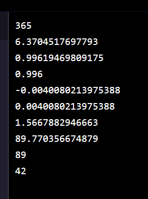

# 3. Prompts:

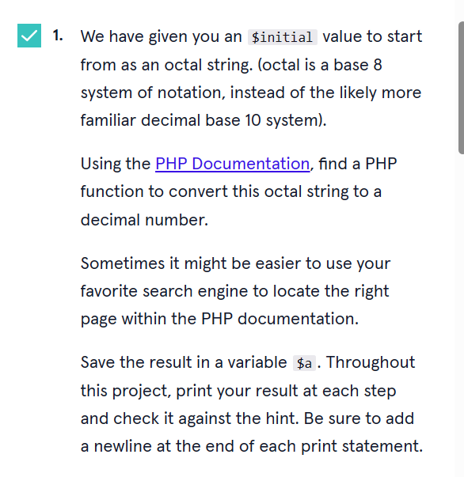

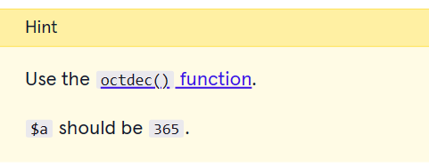

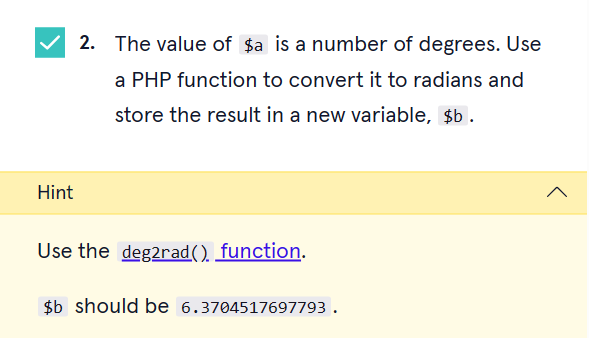

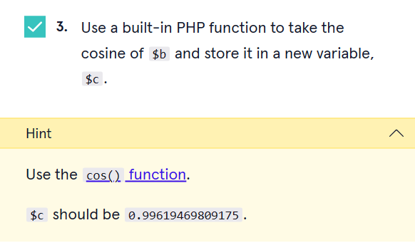

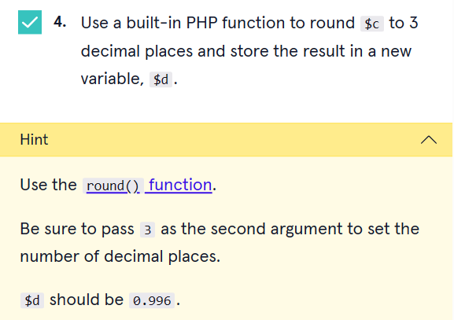

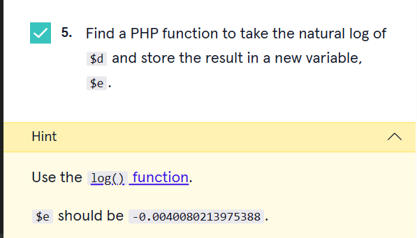

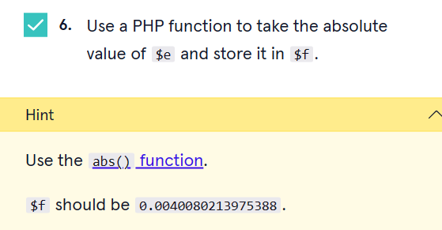

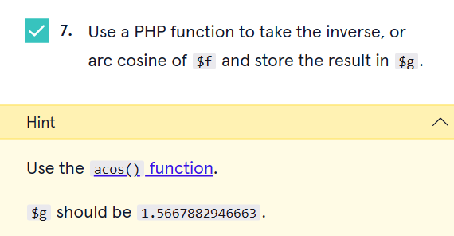

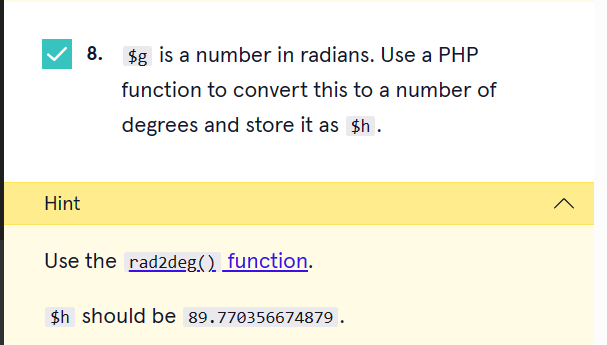

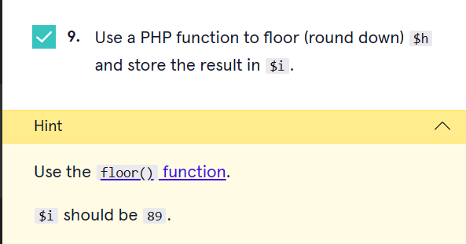

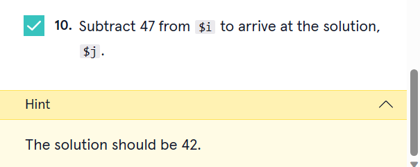

